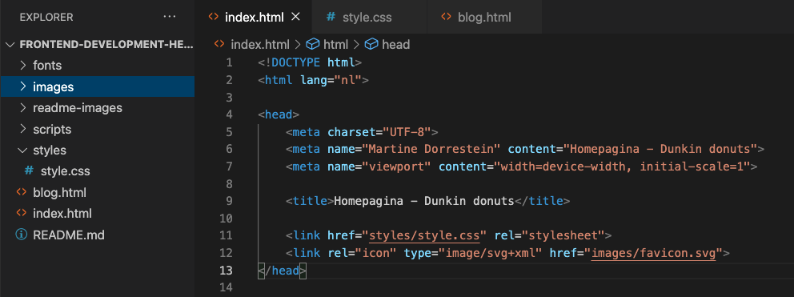

# Procesverslag
Markdown is een simpele manier om HTML te schrijven.  
Markdown cheat cheet: [Hulp bij het schrijven van Markdown](https://github.com/adam-p/markdown-here/wiki/Markdown-Cheatsheet).

Nb. De standaardstructuur en de spartaanse opmaak van de README.md zijn helemaal prima. Het gaat om de inhoud van je procesverslag. Besteedt de tijd voor pracht en praal aan je website.

Nb. Door *open* toe te voegen aan een *details* element kun je deze standaard open zetten. Fijn om dat steeds voor de relevante stuk(ken) te doen.

## Jij

  
uitwerken voor kick-off werkgroep

  ### Auteur:
 Martine Dorrestein  

  #### Je startniveau:
  Blauw

  #### Je focus:
  Weet ik nog niet
 

## Je website

  
uitwerken voor kick-off werkgroep

  ### Je opdracht:
  Voor de opdracht moet ik twee verscillende pagina's van een website (dunkin.nl) uitwerken met een nette vanilla html, css en javascript. 

  #### Screenshot(s) van de eerste pagina (small screen): 
  Website Dunkin small screen homepagina 
  

  #### Screenshot(s) van de tweede pagina (small screen):
  Website Dunkin small screen blogpagina
  
 

## Toegankelijkheidstest 1/2 (week 1)

  
uitwerken na test in 2e werkgroep

  ### Bevindingen
  Lijst met je bevindingen die in de test naar voren kwamen:

## Breakdownschets (week 1)

  
uitwerken na afloop 3e werkgroep

  ### de hele pagina: 
  
De blauwe tekst is de feedback van Marten tijdens de les. Deze heb ik in de uitwerking ook toegevoegd.

### Feedback Marten:
  
  Marten was in het algemeen erg tevreden over mijn twee breakdownschetsen. Mijn voornaamste fout die ik gemaakt had was dat mijn html semantischer correcter mocht. Ik was namelijk te erg geneigd om te kijken naar de grote van de lettertypes om vanuit daar de hierachie te bepalen. Marten heeft mij uitgelegd dat achteraf door middel van CSS de grote later ga fixen.
  
## Aantekeningen in de klas (week 1)

Goed om te weten:

- Maak screenshots van de website
- Elke section heeft een heading
- Handig om eerst je website te scannen en bijv de kleuren in een css property te zetten
- Elke variablele beginnen met - - (zonder spatie)

Inclusively hidden

Wanneer je tekst voor de screenrecording wilt verwijderen dan kan je inclusively hidden gebruiken. Denk hierbij aan bijv. kopjes met “Lees meer”, voor de screenreader is dit niet interessant.

[Inclusively Hidden | CSS-Tricks](https://css-tricks.com/inclusively-hidden/)

Vragen tijdens de les

- Wat bedoel je met mobile first? We moeten toch eerst voor desktop maken?

Waar moet ik me in verdiepen?

- Flexbox
- Grid

### Homepagina menu: 
  

###   Homepagina Bestel knop
  

###   Blogpagina Dropdown menu

## Voortgang 1 (week 2)

  
uitwerken voor 1e voortgang

  ### Stand van zaken
  hier dit ging goed & dit was lastig (neem ook screenshots op van delen van je website en code)

  ### Agenda voor meeting
  samen met je groepje opstellen

  | student 1      | student 2          | student 3    | student 4        |
  | ---            | ---                | ---          | ---              |
  | dit bespreken  | en dit             | en ik dit    | en dan ik dat    |
  | en dat ook nog | dit als er tijd is | nog een punt | dit wil ik zeker |
  | ...            | ...                | ...          | ...              |

  ### Verslag van meeting
  hier na afloop snel de uitkomsten van de meeting vastleggen

  - punt 1
  - punt 2
  - nog een punt
  - ...

## Voortgang 2 (week 3)

  
uitwerken voor 2e voortgang

  ### Stand van zaken
  Deze week heb ik weer Visual code sinds tijden geopend. Ik moest weer aan alles wennen dus heb veel opgezocht. 
  
  

  ### Agenda voor meeting
  samen met je groepje opstellen

  | student 1      | student 2          | student 3    | student 4        |
  | ---            | ---                | ---          | ---              |
  | dit bespreken  | en dit             | en ik dit    | en dan ik dat    |
  | en dat ook nog | dit als er tijd is | nog een punt | dit wil ik zeker |
  | ...            | ...                | ...          | ...              |

  ### Verslag van meeting
  hier na afloop snel de uitkomsten van de meeting vastleggen

  - punt 1
  - punt 2
  - nog een punt
- ...

## Toegankelijkheidstest 2/2 (week 4)

  
uitwerken na test in 9e werkgroep

  ### Bevindingen
  Lijst met je bevindingen die in de test naar voren kwamen (geef ook aan wat er verbeterd is):

## Voortgang 3 (week 4)

  
uitwerken voor 3e voortgang

  ### Stand van zaken
  hier dit ging goed & dit was lastig (neem ook screenshots op van delen van je website en code)

  ### Agenda voor meeting
  samen met je groepje opstellen

  | student 1      | student 2          | student 3    | student 4        |
  | ---            | ---                | ---          | ---              |
  | dit bespreken  | en dit             | en ik dit    | en dan ik dat    |
  | en dat ook nog | dit als er tijd is | nog een punt | dit wil ik zeker |
  | ...            | ...                | ...          | ...              |

  ### Verslag van meeting
  hier na afloop snel de uitkomsten van de meeting vastleggen

  - punt 1
  - punt 2
  - nog een punt
  - ...

## Eindgesprek (week 5)

  
uitwerken voor eindgesprek

  ### Je uitkomst - karakteristiek screenshots:
  

  ### Dit ging goed/Heb ik geleerd: 
  Korte omschrijving met plaatjes

  

  ### Dit was lastig/Is niet gelukt:
  Korte omschrijving met plaatjes

  

## Bronnenlijst

  
continu bijhouden terwijl je werkt

  Nb. Wees specifiek ('css-tricks' als bron is bijv. niet specifiek genoeg). 
  Nb. ChatGpT en andere AI horen er ook bij.
  Nb. Vermeld de bronnen ook in je code.

  1. bron 1
  2. bron 2
  3. ...

