# Procesverslag
Markdown is een simpele manier om HTML te schrijven.  
Markdown cheat cheet: [Hulp bij het schrijven van Markdown](https://github.com/adam-p/markdown-here/wiki/Markdown-Cheatsheet).

Nb. De standaardstructuur en de spartaanse opmaak van de README.md zijn helemaal prima. Het gaat om de inhoud van je procesverslag. Besteedt de tijd voor pracht en praal aan je website.

Nb. Door *open* toe te voegen aan een *details* element kun je deze standaard open zetten. Fijn om dat steeds voor de relevante stuk(ken) te doen.

## Jij

  
uitwerken voor kick-off werkgroep

  ### Auteur:
 Martine Dorrestein  

  #### Je startniveau:
  Blauw

  #### Je focus:
  Weet ik nog niet
 

## Je website

  
uitwerken voor kick-off werkgroep

  ### Je opdracht:
  Voor de opdracht moet ik twee verscillende pagina's van een website (dunkin.nl) uitwerken met een nette vanilla html, css en javascript. Website dunkin: https://www.dunkin.nl/

  #### Screenshot(s) van de eerste pagina (small screen): 
  Website Dunkin small screen homepagina 
  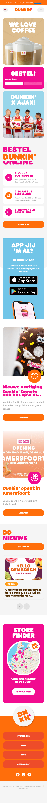

  #### Screenshot(s) van de tweede pagina (small screen):
  Website Dunkin small screen blogpagina
  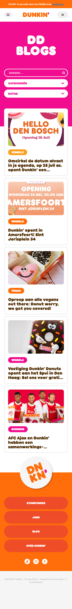

## Toegankelijkheidstest 1/2 (week 1)

  
De toegankelijkheid van de website heb ik getest met de voiceover van mac. Ik vond het erg lastig om de punten naar voren te halen die niet klopte aangezien de VO erg snel praatte. e werkgroep

  ### Bevindingen
1. Ontbrekende alt-tekst: Het lijkt erop dat sommige afbeeldingen op de website mogelijk geen alt-tekst bevatten, waardoor gebruikers met screenreaders de inhoud van deze afbeeldingen niet begrijpen
2. Onvoldoende semantische structuur: Mogelijk wordt er onvoldoende gebruik gemaakt van semantische HTML-tags, wat kan leiden tot een minder duidelijke structuur voor screenreaders.
3. Verwarrende linkteksten: De linkteksten op de website zijn mogelijk niet altijd duidelijk en specifiek genoeg, waardoor het voor gebruikers met screenreaders moeilijk kan zijn om de bestemming van de links te begrijpen.
4. knoppen hebben geen altekst waardoor de gebruiker van de screeenreader niet weet of het wel of niet klikbaar is.
5. Bij verschillende elementen hebben de kleuren een te laag contrast waardoor slechtzienden maar ook kleurenblind personen geen onderscheid kunnen maken van het verschil.
6. De screenreader bij het openen van de website met" "Dunkin is op zoek naar jou! Bekijk onze vacatures!" (zie afbeelding)
  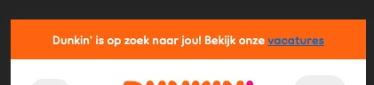 Dit is voor de luisteraar van de screenreader geen relevante informatie om de website te begrijpen dus zou weg moeten worden gelaten voor screenreader.
7. De volgorde van de koppen kloppen niet. De meeste sections beginnen met een H2 die gevolgd wordt met een H5. Dit klopt niet en zou een H3 moeten zijn.
8. Je kunt met KO niet makkelijk naar een bepaald kopje, want dat moet je alle andere inhoudselementen met dezelfde functie langsgaan.
9. Het menu wordt door de screenreader niet aangegeven
   

## Breakdownschets (week 1)

  
uitwerken na afloop 3e werkgroep

  ### de hele pagina: 
  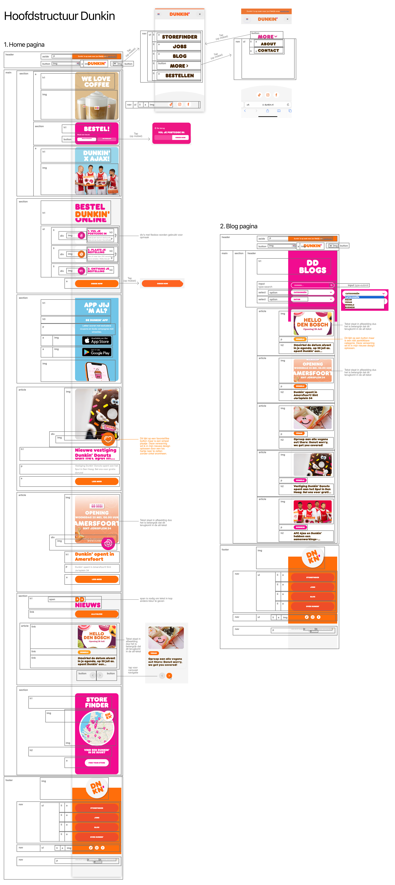
De blauwe tekst is de feedback van Marten tijdens de les. Deze heb ik in de uitwerking ook toegevoegd.

### Feedback Marten:
  
  Marten was in het algemeen erg tevreden over mijn twee breakdownschetsen. Mijn voornaamste fout die ik gemaakt had was dat mijn html semantischer correcter mocht. Ik was namelijk te erg geneigd om te kijken naar de grote van de lettertypes om vanuit daar de hierachie te bepalen. Marten heeft mij uitgelegd dat achteraf door middel van CSS de grote later ga fixen.
  

### Homepagina menu: 
  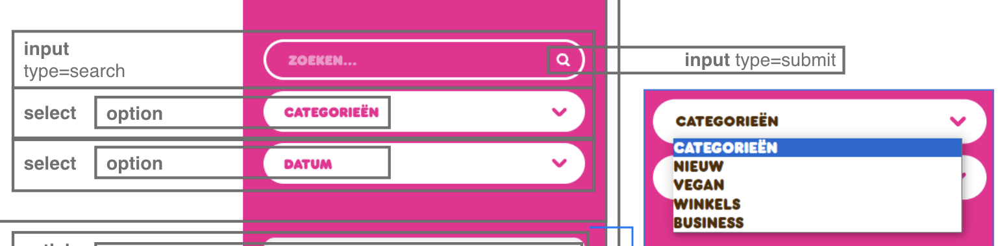

###   Homepagina Bestel knop
  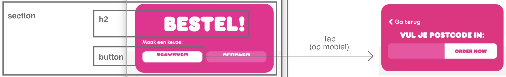

###   Blogpagina Dropdown menu

### Aantekeningen in de klas (week 1)

Goed om te weten:

- Maak screenshots van de website
- Elke section heeft een heading
- Handig om eerst je website te scannen en bijv de kleuren in een css property te zetten
- Elke variablele beginnen met - - (zonder spatie)

Inclusively hidden

Wanneer je tekst voor de screenrecording wilt verwijderen dan kan je inclusively hidden gebruiken. Denk hierbij aan bijv. kopjes met “Lees meer”, voor de screenreader is dit niet interessant.

[Inclusively Hidden | CSS-Tricks](https://css-tricks.com/inclusively-hidden/)

Vragen tijdens de les

- Wat bedoel je met mobile first? We moeten toch eerst voor desktop maken?

Waar moet ik me in verdiepen?

- Flexbox
- Grid

## Voortgang 1 (week 2)

  
De eerste twee weken heb ik me bezig gehouden met de DLO oefening over grid. Ik vond dit in eerste instantie lastig te begrijpen waardoor ik hier veel verdieping in heb gemaakt. Daarnaast ben ik bezig geweest met het vullen van mijn HTML website gebasseerd op mijn breakdownschets. Omdat ik mijn breakdownschets erg nauwkeurig had gemaakt, was dit een makkelijk werkje. Ook heb ik me bezig gehouden met alle afbeeldingen stoppen in mijn html pagina. 
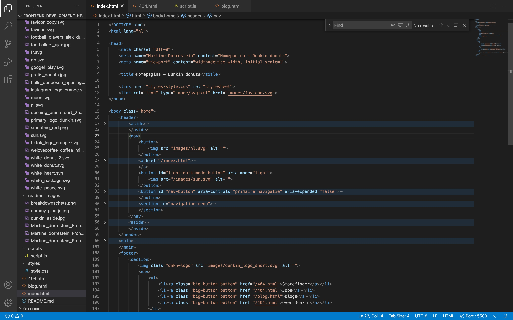

    e voortgang

  ### Stand van zaken
  - html van zowel de homepagina als blogpagina staat in de code
  - Alle afbeeldingen zijn toegevoegd

 
 

## Voortgang 2 (week 3)

  
Deze week heb ik me verdiept in Flexbox. 

Wat is flexbox?
Flexbox is als een superheld voor het regelen van de indeling van elementen op een website. Het maakt het makkelijker om dingen naast elkaar te zetten, ze in het midden van een pagina te plaatsen of zelfs in een kolom te zetten.

Stel je voor dat je een rij blokken op je website hebt en je wilt dat ze allemaal dezelfde hoogte hebben, ongeacht hoeveel tekst erin staat. Met Flexbox kan je dat makkelijk doen! Het helpt je ook om de ruimte tussen de blokken te regelen of om ze te laten uitrekken om de beschikbare ruimte in te nemen.

Dus kort gezegd, Flexbox geeft je de kracht om de lay-out van je website flexibeler en eenvoudiger te beheren. Het maakt het leven van webontwikkelaars een stuk gemakkelijker door hen controle te geven over hoe dingen eruitzien en zich gedragen op een webpaginae voortgang

  ### Stand van zaken
- Deze week heb ik me verdiept in Flexbox door middel van een video (zie bron 1)
- Daarnaast heb ik me alvast verdiept in CSS en HTML. Tijdens de les kwam ik erachter dat ik behoorlijk is weggezakt en dit wilde ik graag weer ophalen (zie bron 2,3 en 4)

## Toegankelijkheidstest 2/2 (week 8)

  
uitwerken na test in 9e werkgroep

  ### Bevindingen
  Lijst met je bevindingen die in de test naar voren kwamen (geef ook aan wat er verbeterd is):

## Voortgang 3 (week 4)

  
Deze week stond in het teken van JavaScript. JavaScript helpt bij het efficiënter schrijven van code en bij het laten samenwerken van HTML-elementen. Via het Document Object Model (DOM) kun je verwijzen naar HTML-elementen. Om ook CSS hierbij te betrekken, gebruik je document.querySelector in JavaScript, waarmee je het bijbehorende element uit de CSS kunt selecteren. Verder kun je met addEventListener een functie laten uitvoeren. Tot slot kun je de console van een browser gebruiken om naar eventuele fouten te kijken en de uitvoer van je code te controleren.e voortgang

  ### Stand van zaken
  - Deze week heb ik me verdiept in Javascript doordat ik oefeningen heb gemaakt op DLO en de volgende video's heb bekeken (zie bron 5 en 6)
  - Ik ben begonnen met mijn start aan CSS. Het is me gelukt om de helft van de homepagina te maken.(zie afbeeldingen)

CSS screenshots

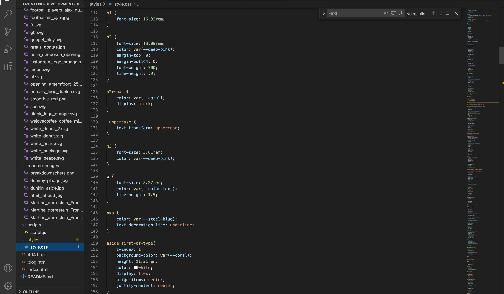
  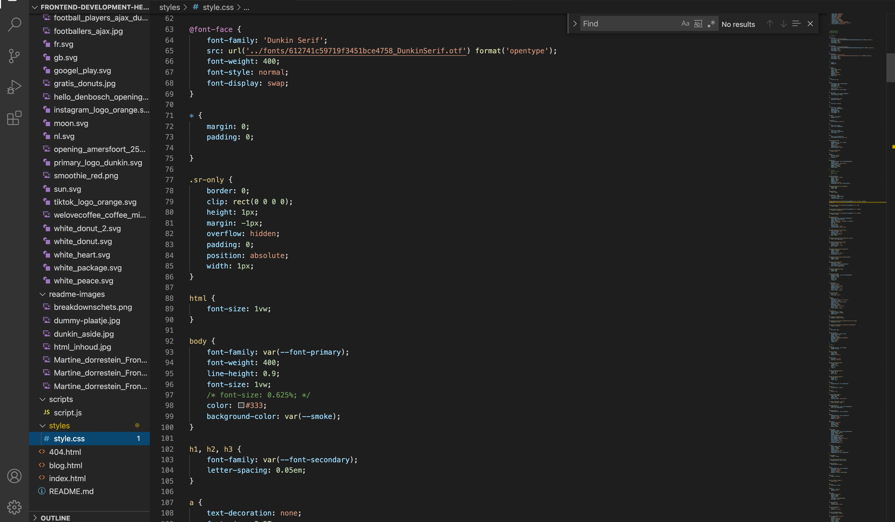
   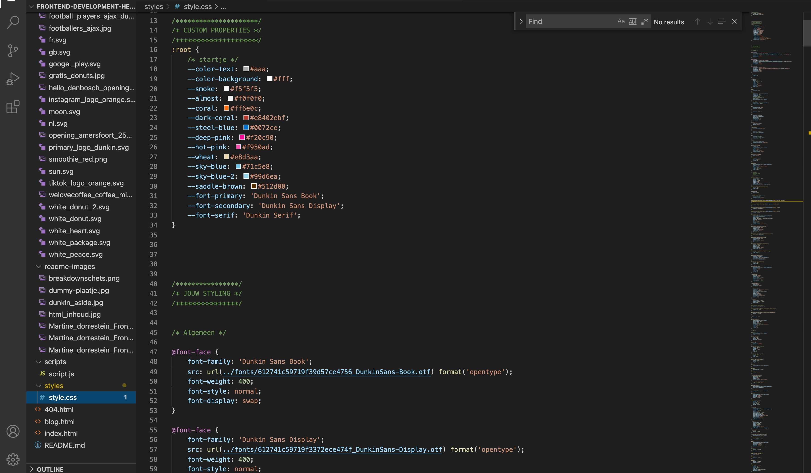
   
HMTML screenshots
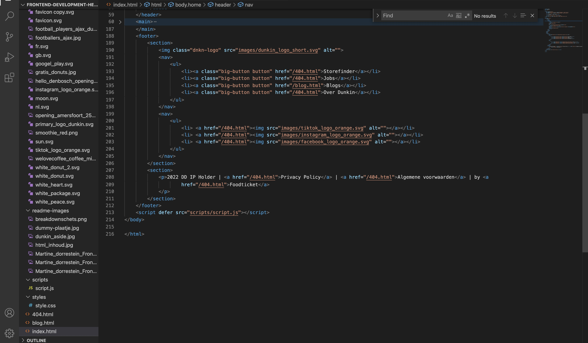
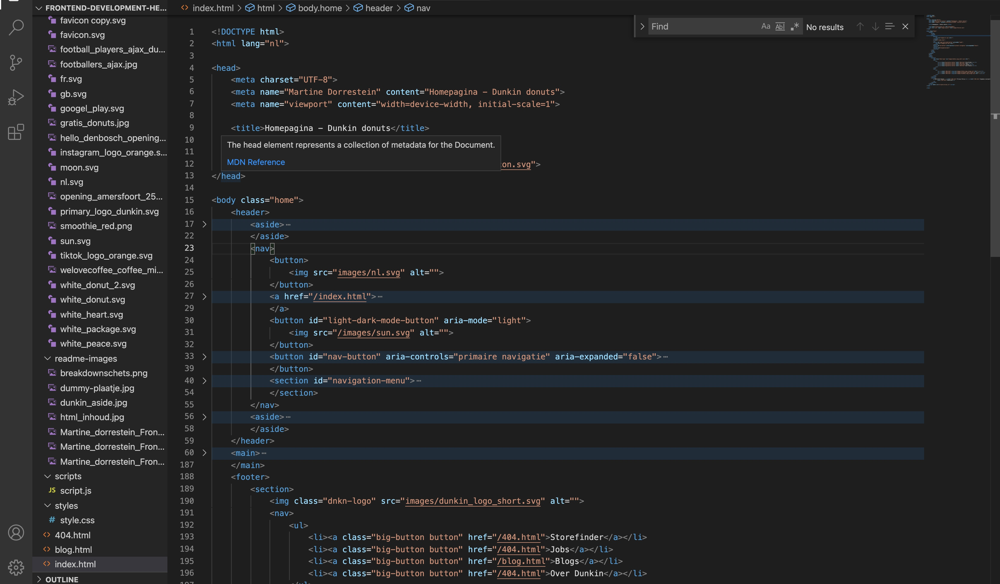

## Voortgang 4 (week 5) positioneren en voortgang 2

  

Deze les behandelde het onderwerp 'positioneren'. Met positioneren wil je een element op een specifieke locatie binnen een ouder- of schermelement plaatsen. Er zijn vijf soorten positioneringen:

Position: static
Dit is de standaardpositie en wordt bepaald door de plaats in de HTML, met behulp van eigenschappen zoals top, right, bottom en left. Het wordt ook wel het 'flow lay-out' genoemd.

Position: relative
Houdt een element in de stroom van elementen.

Position: absolute
Het element wordt uit de stroom gehaald, waardoor je elementen los van elkaar kunt positioneren.

Position: fixed
Het element wordt uit de stroom gehaald, maar blijft wel op een vaste plek staan, zelfs als je naar beneden scrolt op de pagina.

Position: sticky
Houdt een element in de stroom. Als het element uit het zicht verdwijnt tijdens het scrollen, blijft het element op zijn plek 'plakken'.

Zie bron 7 voortgang

  ### Stand van zaken
- Homepagina afgemaakt met HTML en CSS
   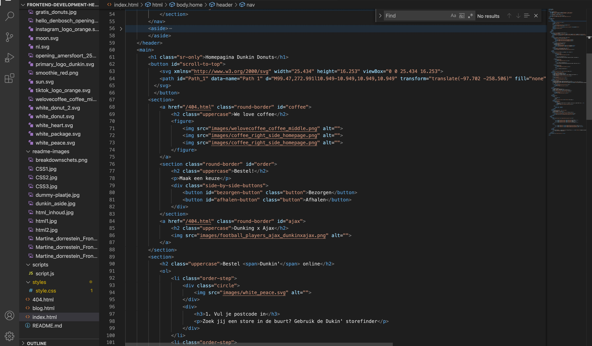
- Begonnen aan de blogpagina
-  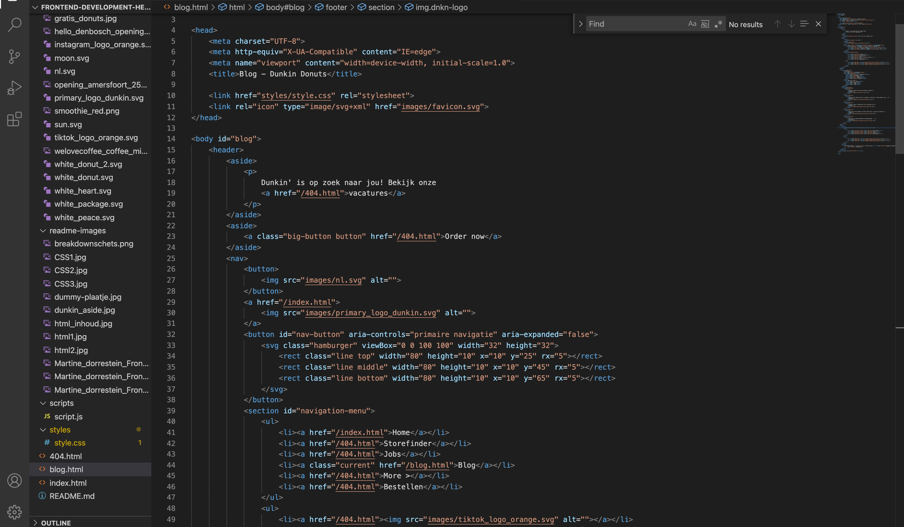

### Voortgang 2
- Mijn html zag er goed uit en alles was in orde.
- Ik mag voor mijn CSS rekening houden dat ik niet dubbelop mijn code schrijf. De code is af en toe namelijk dubbelop en dit zorgt ervoor dat het onoverzichtelijk wordt.

## Voortgang 5 (week 6) animeren

  
Voor de opdracht zullen we moeten werken met een animatie. Tijdens de les hebben we uitleg gekregen over hoe we deze animatie kunnen maken.
Animaties via CSS zijn manieren om elementen op een webpagina dynamisch te laten bewegen, veranderen of van vorm te laten veranderen. Met CSS-animaties kun je eigenschappen zoals positie, grootte, kleur en transparantie van HTML-elementen soepel en gecontroleerd aanpassen.e voortgang

  ### Stand van zaken
  - Ik heb mijn blogpagina afgekeregen.
  -Navigatie menu (zie bron 7)
  - Dit betekent dat ik me kan verdiepen in het toevoegen van Surface plane elementen. Ik heb de volgende surface plane elementen toegevoegd;
    1. SVG icons stylen en animeren --> zie hamburgermenu die wordt geanimeerd naar een kruisje wanneer je op het hamburgermenu klikt (zie bron 10)
    2. Advanced positioning (sticky, fix, etc.) (bron 9)
    3. DOM methode --> zie navigatiebar (zie bron 7)
    4. Darkmode, lightmode --> zie maantje/zonnetje op de navigatiebar links naast het DUNKIN logo (zie bron 11)
    5. Scroll to top button --> zie oranje ronde knop rechts onder de pagina (zie bron 12)

## Eindgesprek (week 7)

  
uitwerken voor eindgesprek

  ### Je uitkomst - karakteristiek screenshots:
  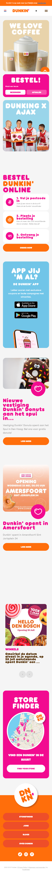
  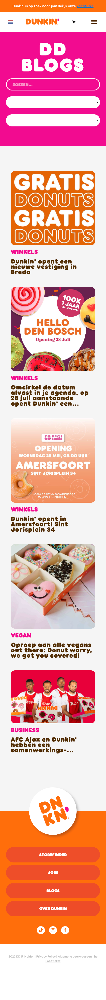

  ### Dit ging goed/Heb ik geleerd: 
  Korte omschrijving met plaatjes
- Ik heb geleerd hoe ik semantisch correct moet coderen (plaatje 1)  
- Ik heb geleerd om elementen aan te roepen in mijn html door middel van classes (plaatje 2)
- Hamburgerknop geleerd te maken met javascript erbij
- Animaties geleerd te maken door middel van css en javascript
- Ik heb veel geleerd over het element Sticky en hoe ik iets laat 'kleven' aan de bovenkant
- DOM manipuleren
- Advanced positioning met fixed
- Geleerd hoe ik kan switchen naar een darkmode

  ### Dit was lastig/Is niet gelukt:
  - Navigatiemenu

  

## Bronnenlijst

  
continu bijhouden terwijl je werkt

  Nb. Wees specifiek ('css-tricks' als bron is bijv. niet specifiek genoeg). 
  Nb. ChatGpT en andere AI horen er ook bij.
  Nb. Vermeld de bronnen ook in je code.

  1. bron 1 What is flexbox? https://www.youtube.com/watch?v=dz-bnc1yteI
  2. bron 2 HTML tutorial voor beginners https://www.youtube.com/watch?v=gMBUxCgcz1g
  3. bron 3 Learn CSS in 20 minutes https://www.youtube.com/watch?v=1PnVor36_40
  4. Bron 4 How to link a CSS stylesheet using html https://www.youtube.com/watch?v=4OMdzHnys9o
  5. Bron 5 JAvascript tutorial voor beginners https://www.youtube.com/watch?v=W6NZfCO5SIk
  6. Bron 6 100+ JavaSCript Concepts you need to know https://www.youtube.com/watch?v=lkIFF4maKMU
  7. Bron 7 Position artikel https://css-tricks.com/almanac/properties/p/position/
  8. Bron 8 Navigatie menu https://www.w3schools.com/howto/howto_js_mobile_navbar.asp
  9. Bron 9 Sticky https://jsfiddle.net/b43hj/
  10. Bron 10 Basic, intermediate  & pro animated hamburger icons https://www.youtube.com/watch?v=R00QiudbD4Y
  11. Bron 11 How to make a website light/dark toggle with CSS & JS https://www.youtube.com/watch?v=wodWDIdV9BY
  12. Bron 12 Scroll down https://stackoverflow.com/questions/15935318/smooth-scroll-to-top 

